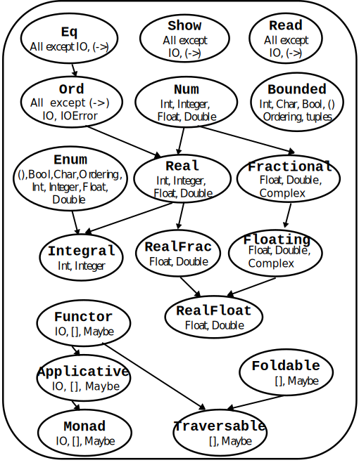

# Functional Programming with Haskell

- [Functional Programming with Haskell](#functional-programming-with-haskell)
  - [Basic operations](#basic-operations)
    - [Setup](#setup)
    - [Guidelines](#guidelines)
    - [Types](#types)
      - [`Bool`, `Char`, `String`](#bool-char-string)
      - [Type class `Real`](#type-class-real)
        - [Type class `Integral`](#type-class-integral)
        - [Type class `Fractional`](#type-class-fractional)
    - [❗ Strong and Static Typing](#-strong-and-static-typing)
    - [Built-in Functions](#built-in-functions)
      - [Boolean Logic Operators](#boolean-logic-operators)
      - [Arithmetic Operators](#arithmetic-operators)
      - [Division](#division)
      - [Exponentiation](#exponentiation)
      - [Common Math Functions](#common-math-functions)
      - [❗ Type Conversion](#-type-conversion)
      - [Inequality Operator](#inequality-operator)
  - [The `Hello World` function](#the-hello-world-function)
    - [The `$` operator](#the--operator)
  - [Conditions](#conditions)
  - [Type Inference](#type-inference)
  - [Lists](#lists)
    - [General Notes](#general-notes)
    - [Constructing Lists](#constructing-lists)
    - [Built-in List Functions](#built-in-list-functions)
      - [Is the list empty?](#is-the-list-empty)
      - [Accessing elements](#accessing-elements)
      - [Simple operations](#simple-operations)
      - [Combining Lists](#combining-lists)
    - [`Data.List`-specific functions](#datalist-specific-functions)
  - [Characters. Strings = Lists of Characters. Type Aliases](#characters-strings--lists-of-characters-type-aliases)
  - [List Comprehension](#list-comprehension)
    - [General Syntax](#general-syntax)
    - [Range Syntax (Numeric Intervals)](#range-syntax-numeric-intervals)
    - [Examples](#examples)
  - [Higher-Order Functions](#higher-order-functions)
    - [Definition](#definition)
    - [Currying and Partial Function Application](#currying-and-partial-function-application)
      - [What is Currying?](#what-is-currying)
      - [What is Partial Function Application?](#what-is-partial-function-application)
      - [Defining a function on functional level](#defining-a-function-on-functional-level)
    - [Practice defining higher-order functions](#practice-defining-higher-order-functions)
  - [Lambda Expressions](#lambda-expressions)
    - [Key Characteristics](#key-characteristics)
    - [Syntax](#syntax)
    - [Practice defining lambda expressions](#practice-defining-lambda-expressions)
  - [Tuples / Vectors / Ordered pairs](#tuples--vectors--ordered-pairs)
    - [Built-in Tuple Functions](#built-in-tuple-functions)
    - [Example: Representing Points in 2D](#example-representing-points-in-2d)
  - [Type Classes](#type-classes)
    - [Example: From Specific to Generic](#example-from-specific-to-generic)
    - [Common Type Classes](#common-type-classes)
    - [Practice polymorphic functions](#practice-polymorphic-functions)
  - [Folding (Map Reduce)](#folding-map-reduce)
    - [What is folding?](#what-is-folding)
    - [Practice folding](#practice-folding)
  - [Algebraic Data Types (ADTs)](#algebraic-data-types-adts)
    - [What are ADTs?](#what-are-adts)
    - [Example ADTs](#example-adts)
    - [Named Fields](#named-fields)

## Basic operations

### Setup

- An online Haskell compiler (**recommended**): <https://onecompiler.com/haskell>.
- Install Haskell on your machine: <https://github.com/SimeonHristov99/fp.additional.is/tree/main/GuideForInstallingHaskell>

### Guidelines

Here is a function in C++ (note how everything is marked as `const` - just like it'll be in Haskell):

```c
int add(const int x, const int y)
{
   return x + y;
}
```

<details>
<summary>Which part is the declaration and which part is the definition?</summary>

```c
int add(const int x, const int y) // <- declaration
{                                 // <- definition
   return x + y;                  // <- definition
}                                 // <- definition
```

</details>

- **Very** whitespace sensitive, i.e. tabs, spaces, new lines matter (a lot).
- Comments:
  - use `--` for single line comments.
  - use `{--}` for multiline comments.
- Everything is a function here!
  - General pattern: `fname :: [type1 -> type2 -> ... ->]returnType`
  - The `add` function from above in Haskell would be: `add :: Int -> Int -> Int`.
    - all arguments are always **implicitly marked as `const`**.

Here is a function definition in Haskell:

```haskell
a :: Int
a = 5
```

<details>
<summary>How would you read those two lines aloud?</summary>

```haskell
a :: Int -- "a" is a function that returns a whole number
a = 5    -- "a" is a function that always returns the number 5.
```

</details>

- `a++`, `++a` <- invalid. use: `a + 1`.
- Use camel case to name identifiers, i.e. `myFunction`.
- When passing negative numbers as arguments surround them in brackets: ex. `helper (-1)`

<details>
<summary>How will the above get interpreted if there were no brackets?</summary>

First of all, we'll have this: `helper - 1`.

Which would get interpreted as "subtract `1` from the result of calling `helper`".

</details>

### Types

The types in Haskell are grouped in type classes: a set of atomic types and other type classes which have common behavior/operations.



#### `Bool`, `Char`, `String`

Name: `Bool`
Description: Holds boolean values.
Allowed values: `True`, `False`

Name: `Char`
Description: Store ASCII characters. Equivalent to `char` in `C++`.
Allowed values: Any ASCII character: `'a'`, `'1'`, `'C'`, `'\n'`, ...

Name: `String`
Description: Store characters in a `list` data structure. Equivalent to `std::string` and `const char*` in `C++`.
Allowed values: Any continuation of characters: `"Haskell"`.

#### Type class `Real`

##### Type class `Integral`

Name: `Int`
Description: Store whole numbers with a maximum size of `32` bits.
Allowed values: Any whole number: `1`, `10`, `-153`, ...

Name: `Integer`
Description: Store whole numbers without a cap on memory
Allowed values: Any whole number including very large ones: `1`, `10`, `-153`, `123456789123456789123456798`, ...

<details>
<summary>When should we use "Int" and when should we use "Integer"?</summary>

We'll follow [Occam's razor](https://en.wikipedia.org/wiki/Occam%27s_razor) principle:

- Use `Int` when the number is small enough;
- Use `Integer` only when `Int` does not work (or the compiler tell us to use `Integer`).

</details>

##### Type class `Fractional`

Name: `Float`
Description: A single-precision (32-bit) approximation number of a real number. Equivalent to `float` in `C++`.
Allowed values: Any floating point number that can be represented with `32` bits: `1.52`, ...

Name: `Double`
Description: A double-precision (64-bit) approximation number of a real number. Equivalent to `double` in `C++`.
Allowed values: Any floating point number that can be represented with `64` bits: `1.5252525252525252525252525252`, ...

Name: `Rational`
Description: Arbitrary-precision rational numbers. Analog of `Integer` but for floating point numbers.
Allowed values: Any floating point number.

### ❗ Strong and Static Typing

Remember the following three principles:

1. All **types** start with a **capital** letter! All **functions and variables** start with a **lowercase** letter!
2. Strongly typed language: All **types** must be **known at compile time**! No casting during runtime!
3. Statically typed language: If `f` returns `Int`, then `f` **cannot** return `Double`! The programmer **must** specify what types each function works with!

### Built-in Functions

#### Boolean Logic Operators

- `&&` – logical AND  
- `||` – logical OR  
- `not` – logical NOT

```haskell
-- Logical AND
and1: Bool
and1 = True && True      -- True
and2: Bool
and2 = False && True     -- False (short-circuiting)

-- Logical OR
or1: Bool
or1 = True || False      -- True (short-circuiting)
or2: Bool
or2 = False || False     -- False

-- Logical NOT
not1: Bool
not1 = not True          -- False
not2: Bool
not2 = not False         -- True
```

#### Arithmetic Operators

Basic arithmetic: `+`, `-`, `*`:

- ⚠️ Operands must be of the same type (e.g., `Int * Int`, `Double * Double`).
  - ✖️ `5 * 3.2` will cause a **type error** if not properly converted.

#### Division

**Only for type class `Integral` (whole numbers):**

- `div`: quotient (integer division).
- `mod`: remainder (like `%` in `C++`).

```haskell
-- prefix notation
divExample1 = div 10 5     -- 2
divExample2 = div 123 10   -- 12

-- infix notation
divExample3 = 10 `div` 5   -- 2
divExample4 = 123 `div` 10 -- 12

-- prefix notation
modExample1 = mod 10 5     -- 0
modExample2 = mod 123 10   -- 3

-- infix notation
modExample3 = 10 `mod` 5   -- 0
modExample4 = 123 `mod` 10 -- 3
```

> Note: Use the prefix notation unless you're doing partial function application.

**Only for type class `Fractional`:**

`/` — regular division:

- Equivalent to `/` in `C++`.
- ⚠️ Only for `Fractional` types (`Float`, `Double`, `Rational`).
- ✖️ Cannot be used with `Integral` types.

```haskell
divFloat :: Float
divFloat = 5.0 / 2.0       -- 2.5

divDouble :: Double
divDouble = 7.5 / 3.0      -- 2.5

-- ❌ ERROR: No instance for (Fractional Int) arising from a use of ‘/’
divInt :: Int -> Int -> Int
divInt x y = x / y
```

#### Exponentiation

- `n ^ m` — use when `m` is a **natural number** (`m ∈ ℕ`)  
  `2 ^ 3` ⇒ `8`

- `n ** m` — use when `m` is a **floating-point number**  
  `2 ** 0.5` ⇒ `1.4142135623730951`

- exp — power of `e`
  `exp 5` ⇒ `148.4131591025766`
  `2.71828 ** 5` ⇒ `148.41265995084171`

#### Common Math Functions

- `min`, `max` — return the smaller/larger of two values  
- `odd`, `even` — check parity  
- `gcd` — greatest common divisor  
- `lcm` — lowest common multiple  
- `abs` — absolute value
- `sin`, `cos`, `tan`, `acos`, `asin`, `atan`, `log` (natural logarithm)
- `sqrt` — positive square root  
  > `sqrt 2` ⇒ `1.4142135623730951`  
  > Type: `sqrt :: Double -> Double`

<details>
<summary>How would we read the above line aloud?</summary>

`sqrt` is a function that takes a single argument of type `Double` and returns a value of type `Double`.

</details>

#### ❗ Type Conversion

- **`Int` → `Double`:**  
  `fromIntegral`  
  > `fromIntegral 5` ⇒ `5.0`

We can make the erroneous example from above work by using `fromIntegral`:

```haskell
divInt :: Int -> Int -> Int
divInt x y = fromIntegral x / fromIntegral y
```

- **`Double` → `Int`:**
  - `ceiling` – round up  
  - `floor` – round down  
  - `round` – nearest integer  
  - `truncate` – drop decimal  
  > `round 5.45` ⇒ `5`

#### Inequality Operator

In Haskell, `!=` is written as `/=`:

```haskell
5 /= 5          -- False  
True /= False   -- True
```

## The `Hello World` function

### The `$` operator

- Read as **"after"**.
- Syntax: `function $ expression`.
- Used to reduce number of opening and closing brackets.
- Behavior:
  1. Evaluates the **expression** on the right.
  2. Passes the result to the **function** on the left.
- Notes:
  - Stepping stone for partial function application.
  - If the expression to the right should not be evaluated to the end of the line, then brackets would still be needed.

```haskell
print $ "Hello world"
```

Visual breakdown:

```text
 print             $       "Hello world"
   ^               ^              ^
  / \             / \            / \
 /   \           /   \          /   \
   |               |              |
   |               |              |
   |               |              |
   |               |              |
identifier      identifier       a string
of a function   of a function
```

```haskell
div $ mod 10 5 10
```

```console
Could not deduce (Integral (t0 -> a))
      from the context: (Integral a, Integral (t -> a), Num t)
```

```haskell
div (mod 10 5) 10
```

```console
0
```

## Conditions

Haskell provides four ways to express conditions:

- `if ... then ... else ...` (both `then` and `else` should be defined):

```haskell
greet hour = if hour < 12 then "Good morning" else "Good day"
```

- guards (`|`): analog to `switch` in `C++`:

```haskell
grade score
 | score >= 90 = "A"
 | score >= 80 = "B"
 | otherwise   = "C" -- a synonym for `True` / `default` in `C++`
```

- `case ... of ...`: pattern matching after accepting value:

```haskell
describeMaybe :: Maybe Int -> String
describeMaybe mx = case mx of
  Just 0  -> "Zero"
  Just 1  -> "One"
  Just n  -> "Some other number: " ++ show n
  Nothing -> "No value given"
  _       -> error "Impossible!" -- The symbol "_" acts like the default case (wildcard pattern).
```

- Pattern matching before accepting value (**recommended** way for defining specific behavior using discrete values):

```haskell
describeMaybe :: Maybe Int -> String
describeMaybe (Just 0) = "Zero"
describeMaybe (Just 1) = "One"
describeMaybe (Just n) = "Some other number: " ++ show n
describeMaybe Nothing  = "No value given"
describeMaybe _  = error "Impossible!"
```

## Type Inference

<details>
<summary>Can you explain it?</summary>

Let's show it below.

</details>

The compiler (GHC) can *usually* **infer** / guess the types of functions without needing explicit type annotations. This ability is called type inference.

- `fname :: [type1 -> type2 -> ... ->]returnType` <-- This is not needed

- Advice:
  - Do not omit declarations of global functions to have clarity.
  - Optionally, omit declarations of helper / local functions as they are expected to be rather simple and small.

```haskell
-- Explicit
add :: Int -> Int -> Int
add x y = x + y

-- Inferred
add x y = x + y
```

If you have Haskell installed on you computer, you can check the inferred type of any function:

```console
$ ghci
ghci> :l play.hs 
[1 of 2] Compiling Main             ( play.hs, interpreted )
Ok, one module loaded.
ghci> :t add
add :: Num a => a -> a -> a
ghci> 
```

## Lists

### General Notes

- Think of lists as `std::forward_list<a>` in `C++`.
- Homogeneous: all elements must be of the **same type**.
- `[]` is the empty list.
- `[1, 2, 3]` is the list containing the numbers `1`, `2`, and `3`.
- Naming conventions: add a suffix `s` to the identifiers referring to lists:

  - `helper 5 6` ⇒ `helper x y`
  - `helper [1, 2, 3] []` ⇒ `helper xs ys`

<details>
<summary>What is this: "[[]]"?</summary>

A list containing one element - an empty list.

</details>

### Constructing Lists

- **List literal**:
  `[1, 2, 3, 4, 5, 6]`

- **Using `:` (cons)**:

  ```haskell
  1 : []       -- [1]
  1 : [2]      -- [1, 2]
  1 : [2, 3]   -- [1, 2, 3]
  ```

  - `:` **cons**tructs a list from an element and another list.
  - The second argument **must** be a list.

- **List comprehension.** We'll see it in a bit.

### Built-in List Functions

Open the [Data.List package documentation](https://hackage.haskell.org/package/base-4.12.0.0/docs/Data-List.html) and let's answer the following questions. Note that although you'll see the following functions in the package `Data.List`, you don't need to import it to use them as they are part of the standard `Prelude` (imported implicitly).

#### Is the list empty?

<details>
<summary>What are three ways to check for an empty list?</summary>

```haskell
null xs  -- True if xs is empty
xs == [] -- Valid, but not idiomatic
helper [] = error "Empty list" -- Pattern matching
```

</details>

<details>
<summary>Which way will we be striving to use?</summary>

Always try pattern matching first! It's maintains clarity the best. If it's not possible, let's try with functions.

</details>

#### Accessing elements

<details>
<summary>What are two ways in which we can get the first element in a list?</summary>

```haskell
head [1,2,3]      -- 1
(x:xs) => x       -- pattern matching
```

</details>

<details>
<summary>How can we access the last element in a list?</summary>

```haskell
last [1,2,3,4]    -- 4
```

</details>

<details>
<summary>How can we get all elements except the last one from a list?</summary>

```haskell
init [1..5]       -- [1,2,3,4]
```

</details>

<details>
<summary>What are two ways in which we can get all elements except the first one from a list?</summary>

```haskell
tail [1, 2, 3]    -- [2, 3]
(_:xs) => xs      -- pattern matching (notice the wildcard!)
```

</details>

<details>
<summary>How can we get the element at index "n" in a list?</summary>

```haskell
[1,2,3,4,5,6]!!5   -- 6
```

</details>

<details>
<summary>What error would we get if we try running "[1,2,3,4,5,6]!!0"?</summary>

We won't get any errors - this is valid Haskell code:

```haskell
[1,2,3,4,5,6]!!0   -- 1
```

</details>

<details>
<summary>What would this produce "[1,2,3,4,5,6]!!10"?</summary>

```console
*** Exception: Prelude.!!: index too large
CallStack (from HasCallStack):
  error, called at libraries/base/GHC/List.hs:1368:14 in base:GHC.List
  tooLarge, called at libraries/base/GHC/List.hs:1378:50 in base:GHC.List
  !!, called at <interactive>:4:14 in interactive:Ghci2
```

</details>

#### Simple operations

<details>
<summary>How can we get the number of elements in the list "[1, 2, 3]"?</summary>

```haskell
length [1,2,3]       -- 3
```

</details>

<details>
<summary>How can we reverse the list "[1, 2, 3]"?</summary>

```haskell
reverse [1,2,3]      -- [3,2,1]
```

</details>

<details>
<summary>How can we sum up the elements the list "[1 .. 5]"?</summary>

```haskell
sum [1 .. 5]           -- 15
```

</details>

<details>
<summary>How can we get the product of the elements the list "[1 .. 5]"?</summary>

```haskell
product [1..5]       -- 120
```

</details>

<details>
<summary>How can we get the smallest element in the list "[1 .. 5]"?</summary>

```haskell
minimum [1 .. 5]     -- 1
```

</details>

<details>
<summary>How can we get the largest element in the list "[1 .. 5]"?</summary>

```haskell
maximum [1 .. 5]     -- 5
```

</details>

<details>
<summary>How can we get the first "N" elements from a list (ex. first 5 elements from the list [1 .. 10])?</summary>

```haskell
take 5 [1 .. 10]       -- [1, 2, 3, 4, 5]
```

</details>

<details>
<summary>How can we remove the first "N" elements from a list (ex. remove the first 5 elements in the list [1 .. 10])?</summary>

```haskell
drop 5 [1 .. 10]       -- [6, 7, 8, 9, 10]
```

</details>

<details>
<summary>How can we check whether "1" is a member of the list "[16,2,3,4]"?</summary>

```haskell
elem 1 [16,2,3,4]     -- False
elem 1 [14,2,1,4]     -- True
elem 1 [1,2,3,4]      -- True
```

</details>

#### Combining Lists

<details>
<summary>How can we concatenate the lists "[1, 2, 3]" and "[4, 5, 6]"?</summary>

```haskell
[1,2,3] ++ [4,5,6]        -- [1,2,3,4,5,6]
```

</details>

<details>
<summary>How can we flatten the list "[[1, 2, 3], [4, 5, 6]]"?</summary>

```haskell
concat [[1,2,3],[4,5,6]]  -- [1,2,3,4,5,6]
```

</details>

<details>
<summary>Would this work: "concat [1,2,3] [4,5,6]"?</summary>

```console
<interactive>:5:1: error:
    • Couldn't match expected type: [a0] -> t
                  with actual type: [a1]
    • The function ‘concat’ is applied to two value arguments,
        but its type ‘[[a1]] -> [a1]’ has only one
      In the expression: concat [1, 2, 3] [4, 5, 6]
      In an equation for ‘it’: it = concat [1, 2, 3] [4, 5, 6]
    • Relevant bindings include it :: t (bound at <interactive>:5:1)
```

</details>

### `Data.List`-specific functions

- Import in script with:

```haskell
import Data.List
```

- If you are in `ghci`, you can use the `:m` operator:

```console
ghci> transpose [[1,2,3],[4,5,6]]

<interactive>:1:1: error:
    Variable not in scope: transpose :: [[a0]] -> t
ghci> :m Data.List
ghci> transpose [[1,2,3],[4,5,6]]
[[1,4],[2,5],[3,6]]
```

<details>
<summary>How can we remove the duplicates in the list "[1,1,2,3,1,5]"?</summary>

```haskell
nub [1,1,2,3,1,5]     -- [1,2,3,5]
```

</details>

<details>
<summary>How can we sort the elements in the list "[5,4..1]"?</summary>

```haskell
sort [5,4..1]         -- [1,2,3,4,5]
```

</details>

<details>
<summary>How can we sort and then remove the duplicates from the list "[1, 10, 9, 1, 42, 2, 42, 3, 10, 1, 5]"?</summary>

```haskell
nub $ sort [1, 10, 9, 1, 42, 2, 42, 3, 10, 1, 5]   -- [1,2,3,5,9,10,42]
```

</details>

<details>
<summary>How can we combine consecutive equal elements, ex "[1, 10, 10, 9, 9, 9, 2, 10]" => "[[1], [10, 10], [9, 9, 9], [2], [10]]"?</summary>

```haskell
group "Mississippi"   -- ["M","i","ss","i","ss","i","pp","i"]
```

</details>

<details>
<summary>How can create a list in which a value - "V", is duplicated "N" times?</summary>

```haskell
replicate 5 10        -- [10,10,10,10,10]
```

</details>

## Characters. Strings = Lists of Characters. Type Aliases

In Haskell, we can define **type aliases**, similar to how `typedef` works in C++. The keyword for this is `type`.

```haskell
type String = [Char]
```

- The above tells the compiler that the type `String` is a synonym (alias) for `[Char]`.
- `type` **does not create a new type**, it simply gives an existing type a new name.
- Useful when we want to include more semantics when typing functions.
- The alias (left-hand side of the equation) can be used **anywhere** the actual type (right-hand side) can be used — including:
  - Function signatures
  - Type annotations
  - Pattern matches

```haskell
greet :: String -> String
greet name = "Hello, " ++ name

-- Behind the scenes, this is equivalent to:
greet' :: [Char] -> [Char]
greet' name = "Hello, " ++ name
```

```haskell
type Name = String
type Age  = Int

type Person = (Name, Age)
```

This makes function signatures easier to read:

```haskell
displayPerson :: Person -> String
```

Instead of:

```haskell
displayPerson :: (String, Int) -> String
```

<details>
<summary>How can we convert a number into a string?</summary>

We can use the `show` function as long as that type is part of the `Show` typeclass.

```haskell
show 15          -- "15"
```

</details>

<details>
<summary>How can we convert a string into a number?</summary>

We can use the `read` function as long as that type is part of the `Read` typeclass.

```haskell
read "15"        -- 15
```

</details>

Here's a program that attempts to do this:

```haskell
main :: IO()
main = do
    print $ f "15"

f x = read x
```

But if we try to run it, it'll fail:

```console
error:
    • Ambiguous type variable ‘a0’ arising from a use of ‘print’
      prevents the constraint ‘(Show a0)’ from being solved.
      Probable fix: use a type annotation to specify what ‘a0’ should be.
      Potentially matching instances:
        instance Show Ordering -- Defined in ‘GHC.Show’
        instance Show a => Show (Maybe a) -- Defined in ‘GHC.Show’
        ...plus 25 others
        ...plus 12 instances involving out-of-scope types
        (use -fprint-potential-instances to see them all)
    • In the first argument of ‘($)’, namely ‘print’
      In a stmt of a 'do' block: print $ f "15"
      In the expression: do print $ f "15"
  |
3 |     print $ f "15"
  |     ^^^^^
```

<details>
<summary>Why did the program fail?</summary>

The compiler needs to know what type you're expecting from `read`, because many types implement the `Read` typeclass (e.g., `Int`, `Double`, `Bool`, lists, tuples, etc.).

If you don't specify the type, the compiler will complain, because it can't guess your intent.

</details>

<details>
<summary>How should we fix this?</summary>

We should annotate the function explicitly:

```haskell
main :: IO()
main = do
    print $ f "15"

f :: String -> Int
f x = read x
```

</details>

Open the [Data.Char package documentation](https://hackage.haskell.org/package/base-4.12.0.0/docs/Data-Char.html) and let's answer the following two questions.

<details>
<summary>How can we convert a character to a digit?</summary>

```haskell
digitToInt '5'     -- 5
```

</details>

<details>
<summary>How can we convert a digit to a character?</summary>

```haskell
intToDigit 5       -- '5'
```

</details>

## List Comprehension

- A concise and readable way to create lists.
- Inspired by mathematical set notation, hence the syntax is close to it.
- It allows for construction of new lists by **transforming** and **filtering** elements from existing lists in **a single expression**.

### General Syntax

```haskell
[ expression | pattern <- list, condition1, condition2, ... ]
```

- **`expression`** – what to include in the new list;
- **`pattern <- list`** – pulls values out of an existing list (like a for-loop);
- **`conditions`** – optional filters to include only certain elements. All filters have to return `True`, for the element to be passed to the expression (`,` is treated as `&&`).

### Range Syntax (Numeric Intervals)

We can create ranges of numbers using the operator `..` inside square brackets.

```haskell
[ start .. end ]         -- simple range from start to end (inclusive)
[ start, next .. end ]   -- range with a custom step (step = next - start) | by default step = +1 or -1 depending on last value.
```

For floating-point numbers (`Float`, `Double`, `Rational`) ranges are allowed but should be used with caution due to rounding behavior.

```haskell
[0.1, 0.2 .. 1.0]    -- [0.1,0.2,0.30000000000000004,0.4,0.5,0.6,0.7000000000000001,0.8,0.9,1.0]
```

### Examples

<details>
<summary>Implement: get all the numbers between 1 and 6 (inclusive)?</summary>

```haskell
[1,2,3,4,5,6]
```

</details>

<details>
<summary>What would this produce: "[1, 3 .. 6]"?</summary>

```haskell
[1,3,5]
```

</details>

<details>
<summary>What would this produce: "[1, 3 .. ]"?</summary>

This will actually produce an infinite list. If you run this in the console, it'll never stop.

</details>

<details>
<summary>How can we get the first 10 even numbers from an infinite list, starting from 1?</summary>

```haskell
take 10 [n | n <- [1 ..], even n]
```

</details>

<details>
<summary>Implement: add 10 to every element from 1 to 6.</summary>

```haskell
[ x + 10 | x <- [1 .. 6]] -- [11,12,13,14,15,16]
```

</details>

<details>
<summary>Implement: find the even numbers between 1 and 6?</summary>

```haskell
[ x | x <- [1 .. 6], even x] -- [2,4,6]
```

</details>

<details>
<summary>Implement: find the numbers between 1 and 6 that are divisible by 3?</summary>

```haskell
[ x | x <- [1 .. 6], mod x 3 == 0] -- [3,6]
```

</details>

<details>
<summary>Implement: find the numbers between 1 and 6 that are divisible by 3 and also greater than 3?</summary>

```haskell
[ x | x <- [1 .. 6], mod x 3 == 0, x > 3] -- [6]
```

</details>

## Higher-Order Functions

### Definition

Higher-order functions are functions that:

- Take one or more functions as arguments, and/or
- Return a function as a result.

Their main advantage is that they enable concise manipulation of collections.

Anonymous expressions/functions (lambdas) are often passed as arguments to higher-order functions. We'll dive in them in detail in the next section - for now here's their general syntax:

```haskell
(\ x -> f x)
```

### Currying and Partial Function Application

#### What is Currying?

Currying means that every function takes only one argument and returns another function that takes the next argument, and so on. In Haskell, all functions are curried by default.

A function like:

```haskell
add :: Int -> Int -> Int
add x y = x + y
```

is actually interpreted as:

```haskell
add :: Int -> (Int -> Int)
```

So you can do:

```haskell
add5 = add 5    -- add5 :: Int -> Int
add5 3          -- Result: 8
```

#### What is Partial Function Application?

Because functions are curried, you can apply them to **some** of their arguments and get back a new function that takes the remaining ones. This is called partial application. For example:

```haskell
(`mod` 10)  -- is equivalent to: (\ x -> x `mod` 10)
```

You're fixing one side of a function (in this case, the divisor `10`) and returning a function that only needs the other side (the dividend).

We can compose partial function applications using the operator `.`:

- Composition of f and g over x (non-functional way): f (g x)
- Composition of f and g over x (functional way)    : (f . g) x

#### Defining a function on functional level

Such a definition has the following characteristics:

1. At least 1 implicit argument.
2. Functions are composed.
3. The left-most or right-most function is partially applied.

Not every function can be defined on functional level, but you should be able to recognize when this can happen.

Steps to follow to convert a unary function into a definition on functional level:

1. Move the argument to the left-most or right-most side.
2. Replace all brackets with `$`.
3. Partially apply the left-most or right-most function (the one that first processes the argument).
4. Remove the argument from the expression.
5. Replace all `$` with `.`.

Example:

```haskell
import Data.List

main :: IO()
main = do
    print $ f [1,2,3,1,1,2,14,1,1,4,12,124,1,1] -- "[1,2,3,4,12,14,124]"

f :: [Int] -> String
f xs = (show (nub (sort xs)))
```

<details>
<summary>How would we convert this?</summary>

```haskell
import Data.List

main :: IO()
main = do
    print $ f [1,2,3,1,1,2,14,1,1,4,12,124,1,1] -- "[1,2,3,4,12,14,124]"

f :: [Int] -> String
f = show . nub . sort
```

</details>

### Practice defining higher-order functions

The package `Data.List` contains the available higher-order functions. Let's use it again, this time to answer questions related to them:

<details>
<summary>Which hof can we use to apply a function to each element in a list?</summary>

```haskell
map :: (a -> b) -> [a] -> [b]
```

`map f xs` is the list obtained by applying `f` to each element of `xs`, i.e.,

```haskell
map f [x1, x2, ..., xn] == [f x1, f x2, ..., f xn]
map f [x1, x2, ...] == [f x1, f x2, ...]
```

</details>

<details>
<summary>Which hof can we use to remove elements that do not satisfy a condition from a list?</summary>

```haskell
filter :: (a -> Bool) -> [a] -> [a] 
```

`filter`, applied to a predicate and a list, returns the list of those elements that satisfy the predicate; i.e.,

```haskell
filter p xs = [ x | x <- xs, p x]
```

</details>

<details>
<summary>Which hof can we use to check whether every element in a list satisfies a condition?</summary>

```haskell
all :: Foldable t => (a -> Bool) -> t a -> Bool
```

Determines whether all elements of the structure satisfy the predicate.

</details>

<details>
<summary>Which hof can we use to check whether at least one element in a list satisfies a condition?</summary>

```haskell
any :: Foldable t => (a -> Bool) -> t a -> Bool
```

Determines whether any element of the structure satisfies the predicate.

</details>

<details>
<summary>Implement: add 10 to every element between 1 and 3 (inclusive).</summary>

```haskell
map (\x -> x + 10) [1..3] -- [11, 12, 13]
```

Equivalent to:

```haskell
map (+10) [1..3]
```

</details>

<details>
<summary>Implement: keep only the even numbers between 1 and 3.</summary>

```haskell
filter (\x -> even x) [1..3] -- [2]
```

Equivalent to:

```haskell
filter even [1..3]
```

</details>

<details>
<summary>Implement: check whether all numbers between 1 and 6 are odd.</summary>

```haskell
all (\x -> odd x) [1..6] -- False
```

Equivalent to:

```haskell
all odd [1..6]
```

</details>

<details>
<summary>Implement: check whether there at least one odd number in `[2, 4, 6]`.</summary>

```haskell
any (\x -> odd x) [2,4,6] -- False
```

Equivalent to:

```haskell
any odd [2,4,6]
```

</details>

<details>
<summary>Check if a number in `[20, 44, 61]` is divisible by 10.</summary>

```haskell
any (\x -> mod x 10 == 0) [20,44,61] -- True
```

Equivalent to:

```haskell
any ((== 0) . (`mod` 10)) [20,44,61]
```

</details>

## Lambda Expressions

### Key Characteristics

- **Read left to right**, like regular expressions.
- Used for **inline logic**, especially in higher-order functions.
- Known as **"arrow functions"** in JavaScript/TypeScript.
- Similar to:
  - Python: `lambda x: x + 1`
  - C++: `[](int x) { return x + 1; }`

> 💡 [Watch a short intro to C++ lambdas](https://www.youtube.com/watch?v=mWgmBBz0y8c)

### Syntax

```haskell
(\ <parameters> -> <expression>)
```

- Begins with a backslash (`\`) — the lambda symbol.
- Followed by one or more parameters.
- Followed by `->`, pointing to the function body.

### Practice defining lambda expressions

<details>
<summary>Define a lambda that adds 5 to a number.</summary>

```haskell
(\x -> x + 5)
```

</details>

<details>
<summary>How can we define the above using partial function application?</summary>

```haskell
(+ 5)
```

</details>

<details>
<summary>Define a lambda that checks whether a number is greater than 10.</summary>

```haskell
(\x -> x > 10)
```

</details>

<details>
<summary>How can we define the above using partial function application?</summary>

```haskell
(> 10)
```

</details>

<details>
<summary>Define a lambda that adds three numbers together.</summary>

```haskell
(\x y z -> x + y + z)
```

</details>

<details>
<summary>What is the output of the following expression: "print $ (\x y z -> x y z) (\x y -> x + y) 5 7"?</summary>

`12`. Let's break it down:

```text
(\x y z -> x y z) (\x y -> x + y) 5 7

x = (\x y -> x + y)
y = 5
z = 7

(\x y z -> x y z) (\x y -> x + y) 5 7
  => substitute and enter body of left lambda
  => (\x y -> x + y) 5 7

x = 5
y = 7

(\x y -> x + y) 5 7
  => substitute and enter body of left lambda
  => 5 + 7

12
```

</details>

## Tuples / Vectors / Ordered pairs

- Heterogeneous: can contain elements of different types
- Fixed-size data structures (size and types must be explicitly known at compile time).
- Think of them as generalized containers like `std::pair` or arrays in `C++`.

```haskell
-- A tuple with three elements: an Int, a String, and a list of Doubles.
x :: (Int, String, [Double])
```

### Built-in Tuple Functions

- `fst (a, b)`: returns the first element from a tuple.
- `snd (a, b)`: returns the second element from a tuple.

```haskell
fst (5, 6)  -- 5
snd (5, 6)  -- 6
```

> ⚠️ `fst` and `snd` only work on **pairs** (tuples with exactly `2` elements)!

### Example: Representing Points in 2D

```haskell
type Point2D = (Int, Int)
```

Equivalent to:

```cpp
typedef std::pair<int, int> Point2D;
```

Now we can use this alias in function signatures for clarity.

<details>
<summary>Implement: define a function that finds the sum of the coordinates of a point.</summary>

```haskell
helper :: Point2D -> Int
helper x = fst x + snd x
```

</details>

<details>
<summary>Define the logic in a second way (that should be more preferred way when working with tuples).</summary>

```haskell
helper :: Point2D -> Int
helper (x, y) = x + y
```

</details>

## Type Classes

- A way to define generic interfaces that provide behavior for a group of types.
- They allow us to write polymorphic functions that work with any type that implements certain behavior.

In C++, you might write a template like this:

```cpp
template<typename T>
T add(T a, T b) { return a + b; }
```

In Haskell, this is achieved through **type variables with constraints** using **type classes**:

```haskell
add :: (Num a) => a -> a -> a
add a b = a + b
```

- In the above example `(Num a) =>` is a vector with a single **type constraint**.
- `(Num a) =>` states that the type `a` must belong to the `Num` type class — i.e., it must support numeric operations like `+`, `-`, `*`, etc.

### Example: From Specific to Generic

The following function is too specific:

```haskell
helper :: Int -> Int
helper x = x + 10
```

What if we wanted to have the same logic for Integers, Doubles, Floats - should we define 3 more functions?

Not in Haskell - we can instead use a type class constraint:

```haskell
helper :: (Num a) => a -> a
helper x = x + 10
```

This works for any numeric type: `Int`, `Integer`, `Float`, `Double`, `Rational`.

### Common Type Classes

| Type Class | Meaning                                 | Example Types                  |
| ---------- | --------------------------------------- | ------------------------------ |
| `Num`      | Numeric types (`+`, `-`, `*`)           | `Int`, `Float`, `Double`       |
| `Eq`       | Supports equality (`==`, `/=`)          | Most types                     |
| `Ord`      | Supports ordering (`<`, `>`, `compare`) | `Int`, `Char`, `String`        |
| `Show`     | Can be converted to a string (`show`)   | `Int`, `[Char]`, Tuples, Lists |
| `Read`     | Can be parsed from a string (`read`)    | `Int`, `Double`                |

### Practice polymorphic functions

Define a function that returns a string describing the larger of two values.

Examples:

```console
describeMax 5 10
```

```console
"Larger is: 10"
```

```console
describeMax 'a' 'z'
```

```console
"Larger is: 'z'"
```

<details>
<summary>Reveal answer</summary>

```haskell
describeMax :: (Show a, Ord a) => a -> a -> String
describeMax x y = "Larger is: " ++ show (max x y)
```

</details>

## Folding (Map Reduce)

### What is folding?

- Folding reduces a list to a single value by recursively applying a function.
- Think of it as a combination of **mapping** and **aggregating**.

There are two directions for folding:

- Left fold (`foldl`, `foldl1`): processes the list from **left to right**.
  - The accumulator is placed as the left-most element.
- Right fold (`foldr`, `foldr1`): processes the list from **right to left**.
  - The accumulator is placed as the right-most element.

| Function | Initial Value? | Direction     | Empty List Behavior       |
| -------- | -------------- | ------------- | ------------------------- |
| `foldl`  | ✅ Yes          | Left-to-right | Returns the initial value |
| `foldl1` | ❌ No           | Left-to-right | **Error** on empty list   |
| `foldr`  | ✅ Yes          | Right-to-left | Returns the initial value |
| `foldr1` | ❌ No           | Right-to-left | **Error** on empty list   |

Here're their definitions for reference:

```haskell
foldr f z []     = z
foldr f z (x:xs) = f x (foldr f z xs) -- (right-associative)

foldr1 _ [x]     = x
foldr1 f (x:xs)  = f x (foldr1 f xs)

foldl f z []     = z
foldl f z (x:xs) = foldl f (f z x) xs -- (left-associative)

foldl1 _ [x]       = x
foldl1 f (x:y:zs)  = foldl1 f ((f x y) : zs)
```

### Practice folding

<details>
<summary>What would the following expression evaluate to: "foldl (\ acc x -> acc - x) 0 [1, 2, 3]"?</summary>

$$((0 - 1) - 2) - 3 = -6$$

</details>

<details>
<summary>What would the following expression evaluate to: "foldl1 (\ x y -> x - y) [1, 2, 3]"?</summary>

$$(1 - 2) - 3 = -4$$

</details>

<details>
<summary>What would the following expression evaluate to: "foldr (\ x acc -> x + acc) 0 [1, 2, 3]"?</summary>

$$1 + (2 + (3 + 0)) = 6$$

</details>

<details>
<summary>What would the following expression evaluate to: "foldr1 (\ x y -> x + y) [1, 2, 3]"?</summary>

$$1 + (2 + 3) = 6$$

</details>

## Algebraic Data Types (ADTs)

### What are ADTs?

<details>
<summary>How do we define new types in C++?</summary>

We use the `struct`, `class`, `enum`, and `enum class` keywords.

</details>

In Haskell the new data types are called algebraic types and we use the keyword `data`.

```haskell
data <TypeName> [<type variables>] = <Constructor1> | <Constructor2> | ...
```

- `<TypeName>` – the name of the new type.
- `<type variables>` – optional; used to make the type generic.
- `<Constructor>` – a way to construct a value of the new type.

Each constructor can take zero or more arguments, and their names do **not** need to match the type name.

### Example ADTs

<details>
<summary>Create a new data type to represent weather as "cold" or "hot".</summary>

```haskell
data Weather = Hot | Cold
```

</details>

<details>
<summary>Create a new data type to represent the circle and triangle geometric shapes.</summary>

```haskell
data Shape a = Circle a | Triangle a a a
```

</details>

By default, Haskell cannot print custom types:

```haskell
main :: IO()
main = do
    print $ f (Triangle 3 4.1 65.1)

data Shape a = Circle a | Triangle a a a

f :: Shape a -> Shape a
f = id
```

```console
error:
    • No instance for (Show (Shape a0)) arising from a use of ‘print’
    • In the first argument of ‘($)’, namely ‘print’
      In a stmt of a 'do' block: print $ f (Triangle 3 4.1 65.1)
      In the expression: do print $ f (Triangle 3 4.1 65.1)
  |
5 |     print $ f (Triangle 3 4.1 65.1)
  |     ^^^^^
```

To fix this we must derive the `Show` type class:

```haskell
main :: IO()
main = do
    print $ f (Triangle 3 4.1 65.1)

data Shape a = Circle a | Triangle a a a
 deriving (Show)

f :: Shape a -> Shape a
f = id
```

```console
Triangle 3.0 4.1 65.1
```

### Named Fields

We can define types with named fields, similar to structs:

```haskell
data Shape = Circle { radius :: Int }
           | Triangle { x :: Int, y :: Int, z :: Int }
  deriving (Show)
```

Now the field names become getter functions:

```haskell
radius (Circle 5)    -- Result: 5
x (Triangle 3 4 5)   -- Result: 3
```
